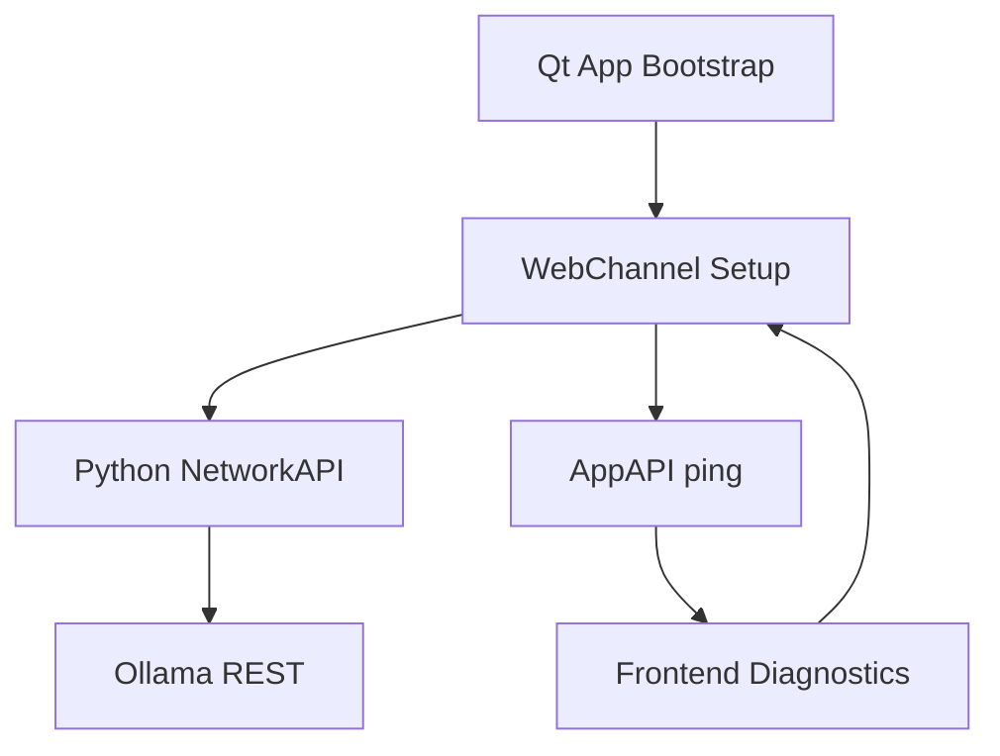

# Design Document

## Overview

Implement a reliable WebChannel and network integration layer for the Cherry Studio Houdini plugin. The design stabilizes three pillars: (1) deterministic WebChannel initialization between Qt and the embedded frontend, (2) a Python-side proxy that mediates Ollama network calls and returns structured responses, and (3) comprehensive diagnostics and fallbacks to eliminate Houdini crashes or silent failures.

## Steering Document Alignment

### Technical Standards (tech.md)
- Follow existing PySide6/WebChannel usage patterns.
- Centralize network access in Python to ensure consistent logging and exception handling.
- Maintain backward compatibility with current Cherry Studio frontend expectations (window.api, window.qt).

### Project Structure (structure.md)
- Keep all Houdini-specific Python logic inside `houdini_plugin/main.py`.
- Frontend adjustments limited to `web/src/renderer/.../OpenAIBaseClient.ts` and small utility stubs.
- Inject helper scripts through `QWebEngineScript` while keeping the main Qt bootstrap clean and modular.

## Code Reuse Analysis

### Existing Components to Leverage
- **Existing WebChannel registration logic**: Extend the current `create_window` function to include consistent ping and initialization hooks.
- **NetworkAPI class**: Reuse and expand it to provide a dedicated `openaiFetch` route for Ollama.
- **Ollama client integration**: Reuse the existing `OpenAIBaseClient` branch for Ollama with new fallbacks.

### Integration Points
- **window.api / window.qt API surface**: Maintain compatibility with the React frontend expecting Electron-like APIs.
- **Frontend model management view**: The design needs to ensure model lists are fetched via the Qt proxy.
- **Ollama local REST endpoints**: The proxy will invoke `/api/tags` (and, if needed, `/v1/models`) using Python’s `urllib`.

## Architecture



### Modular Design Principles
- **Single File Responsibility**: `main.py` handles Qt setup; frontend client files only handle translation and mapping.
- **Component Isolation**: Separate classes for AppAPI, NetworkAPI, diagnostics utilities.
- **Service Layer Separation**: Network calls executed solely within Python.
- **Utility Modularity**: Logging helpers to be built as standalone functions.

## Components and Interfaces

### Component 1 – WebChannelBootstrap
- **Purpose:** Ensure `QWebChannel` initialization, ping handshake, and retry logic without crashing Houdini.
- **Interfaces:** `initialize_webchannel(web_view)`, returning diagnostics; exposes `logConsoleMessage` hook.
- **Dependencies:** PySide6 `QWebEngineScript`, existing host bridge classes.
- **Reuses:** Existing `create_window` workflow.

### Component 2 – NetworkProxy
- **Purpose:** Provide `openaiFetch`, `ollamaListModels`, and `ollamaPullModel` routes that map frontend requests to local Ollama endpoints.
- **Interfaces:** Python slot methods returning JSON strings.
- **Dependencies:** Python `urllib.request`, shared logging helper.
- **Reuses:** Existing `NetworkAPI` class structure.

### Component 3 – FrontendOllamaAdapter
- **Purpose:** Frontend helper that calls new Qt slots, handles fallback, and logs outcomes.
- **Interfaces:** Methods inside `OpenAIBaseClient` for Ollama branch.
- **Dependencies:** `window.qt.network` objects, existing logger service.
- **Reuses:** Current OpenAI client infrastructure.

## Data Models

### OllamaModel
```
OllamaModel = {
  id: string,
  object: 'model',
  owned_by: 'ollama',
  description?: string,
  created_at?: string
}
```

### NetworkProxyResponse
```
NetworkProxyResponse = {
  status: number,
  statusText?: string,
  headers?: Record<string, string>,
  body: string,
  error?: string,
  traceback?: string
}
```

## Error Handling

### Error Scenarios
1. **Scenario 1:** WebChannel fails to initialize within retry limit.
   - **Handling:** Emit warning logs, surface toast in frontend, keep Houdini running, provide manual retry button.
   - **User Impact:** User is alerted that the bridge is unavailable; plugin remains open.

2. **Scenario 2:** Ollama endpoint unreachable or returns error.
   - **Handling:** Python proxy returns structured error JSON; frontend displays “Connection error” with details.
   - **User Impact:** Model list shows fallback message; user can retry or adjust local service.

## Testing Strategy

### Unit Testing
- Mock NetworkAPI calls to ensure proper JSON structure and error handling.
- Validate Qt API exposure (ping returns `pong`).

### Integration Testing
- Launch Houdini plugin in test environment with fake Ollama server; verify model listing.
- Simulate network failure to ensure graceful fallback.

### End-to-End Testing
- Full user flow: start Houdini plugin → ensure WebChannel ready → open model management → list/pull models.
- Regression test: ensure existing Cherry Studio functionality (non-Ollama models) remains unaffected.
