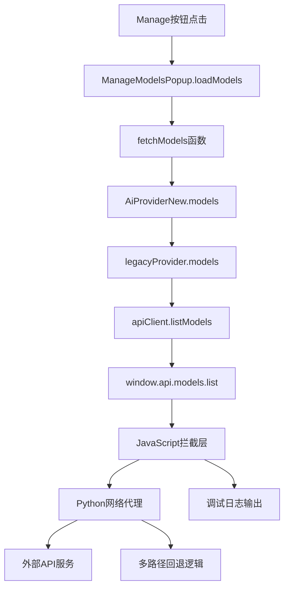

# 设计文档

## 概述

本功能解决Cherry Studio for Houdini中点击"Manage"按钮后外部OpenAI兼容服务（如CherryIN）返回404错误的问题。设计专注于拦截和正确处理点击Manage按钮后的模型列表获取操作，通过JavaScript注入和Python后端网络代理来实现。

## 指导文档对齐

### 技术标准 (tech.md)
设计遵循现有的JavaScript注入模式和QtWebChannel通信机制，保持与现有Houdini插件架构的一致性。

### 项目结构 (structure.md)
实现将遵循现有的houdini_plugin/main.py结构，在inject_electron_api()函数中添加新的拦截逻辑。

## 代码复用分析

### 现有组件利用
- **JavaScript注入机制**: 复用现有的scripts数组和runJavaScript调用模式
- **QtWebChannel通信**: 利用现有的window.qt.network.fetchProxy和window.qt.network.modelList
- **调试日志系统**: 复用现有的console.log调试输出机制
- **网络代理逻辑**: 利用现有的Python NetworkAPI类

### 集成点
- **window.api.models.list**: 通过JavaScript注入拦截和增强现有API调用
- **fetchModels函数**: 在ApiService.ts中的现有函数调用链中添加调试和拦截
- **Python NetworkAPI**: 扩展现有的网络代理功能

## 架构

设计采用分层拦截架构，在JavaScript前端和Python后端之间建立完整的调用链追踪和错误处理机制。

### 模块化设计原则
- **单一文件职责**: 每个拦截点处理调用链的一个特定部分
- **组件隔离**: 调试逻辑与业务逻辑分离
- **服务层分离**: JavaScript拦截层、Python代理层、网络请求层清晰分离
- **工具模块化**: 将调试工具和网络代理工具模块化



## 组件和接口

### JavaScript拦截层
- **目的**: 拦截Manage按钮点击后的模型获取调用链
- **接口**: 
  - `window.api.models.list` 拦截和增强
  - `fetchModels` 函数拦截
  - 全局调试日志输出
- **依赖**: 现有的window.qt对象和注入机制
- **复用**: 现有的JavaScript注入脚本数组结构

### Python网络代理层
- **目的**: 处理外部API请求和错误回退
- **接口**:
  - `NetworkAPI.modelList` 方法
  - `NetworkAPI.fetchProxy` 方法
- **依赖**: urllib网络库和QtWebChannel
- **复用**: 现有的NetworkAPI类结构

### 调试追踪系统
- **目的**: 提供完整的调用链追踪和错误诊断
- **接口**:
  - console.log调试输出
  - 调用链状态记录
- **依赖**: 浏览器控制台和Python终端输出
- **复用**: 现有的调试日志模式

## 数据模型

### 模型获取配置
```
ModelListConfig:
- url: string (API端点URL)
- method: string (HTTP方法，默认GET)
- headers: Record<string, string> (请求头)
- body: string | undefined (请求体)
- fallback: { object: 'list', data: [] } (默认响应)
```

### 调试日志条目
```
DebugLogEntry:
- timestamp: string (时间戳)
- level: 'info' | 'warn' | 'error' (日志级别)
- source: string (来源组件)
- message: string (日志消息)
- data: any (附加数据)
```

## 错误处理

### 错误场景
1. **JavaScript注入失败**
   - **处理**: 检查scripts数组结构，确保所有拦截代码在正确位置
   - **用户影响**: 显示"JavaScript注入失败"错误信息

2. **网络请求超时**
   - **处理**: 实现30秒超时机制，返回空模型列表
   - **用户影响**: 显示"网络请求超时，返回空模型列表"

3. **外部API返回404**
   - **处理**: 记录错误但不中断流程，返回空模型列表
   - **用户影响**: 显示"无法获取模型列表，请检查API配置"

4. **Python后端通信失败**
   - **处理**: 回退到原生fetch，记录警告日志
   - **用户影响**: 显示"使用备用网络请求方式"

## 测试策略

### 单元测试
- JavaScript拦截函数的功能测试
- Python NetworkAPI方法测试
- 调试日志输出验证

### 集成测试
- 完整的Manage按钮点击到模型列表获取流程测试
- JavaScript注入与Python后端通信测试
- 外部API服务集成测试

### 端到端测试
- 用户点击Manage按钮的完整场景测试
- 不同外部服务提供商的兼容性测试
- 错误处理和回退机制测试
