# AI Pipeline 中枢框架 — 详细架构流程图

## 1. 系统全景图

```mermaid
graph TB
  subgraph drivers [驱动层]
    Human["人工操作\n(Web UI / CLI)"]
    ClaudeCode["Claude Code"]
    Codex["OpenAI Codex"]
    OpenClaw["OpenClaw"]
  end

  subgraph sentinelBox [守护 Agent]
    Sentinel["Sentinel\n(小模型常驻)"]
    FastRules["快速规则引擎"]
    BigModel["大模型升级通道"]
  end

  subgraph orchestrationEngine [编排引擎]
    DAGParser["DAG 解析器"]
    TopoSort["拓扑排序"]
    ParallelScheduler["并行调度器"]
    RetryManager["重试管理器"]
    CheckpointManager["检查点管理器"]
  end

  subgraph eventSystem [事件系统]
    EventBus["EventBus\n(发布-订阅)"]
  end

  subgraph nodeLayer [节点层 - 万物皆节点]
    subgraph aiNodes [AI 工具节点]
      SAM3["SAM3 分割"]
      Gen3D["3D 生成"]
      Retopo["自动 Retopo"]
      TexGen["贴图生成"]
      MotionGen["动作生成"]
    end

    subgraph dccNodes [DCC 节点]
      MayaModel["Maya 建模"]
      MayaRig["Maya 绑定"]
      MayaAnim["Maya 动画"]
      HouScatter["Houdini 散布"]
      HouFX["Houdini 特效"]
      HouTerrain["Houdini 地形"]
      KatanaLight["Katana 灯光"]
      KatanaLook["Katana LookDev"]
    end

    subgraph agentNodes [Agent 节点]
      CodeGen["代码生成"]
      ScriptWrite["脚本编写"]
      QACheck["质量检查"]
    end

    subgraph kbNodes [知识库节点]
      KBSearch["KB 检索"]
      KBIngest["KB 入库"]
    end

    subgraph comfyNodes [ComfyUI 节点]
      ComfyRun["Workflow 执行"]
    end

    subgraph utilNodes [通用节点]
      FileConvert["格式转换"]
      ScriptRunner["脚本执行"]
      RenderSubmit["渲染提交"]
    end
  end

  subgraph protocolCore [协议层核心]
    AssetStore["Asset Store"]
    TypeSystem["类型系统\n18 种 AssetType"]
    PortProtocol["Port 协议"]
    NodeRegistry["Node Registry"]
    Context["Pipeline Context"]
  end

  subgraph memorySystem [三层记忆]
    WorkingMem["工作记忆\n(LLM 上下文)"]
    SessionMem["会话记忆\n(内存)"]
    LongTermMem["长期记忆\n(向量DB + DB)"]
  end

  subgraph bridgeLayer [桥接层]
    MayaBridge["Maya Bridge\n(commandPort / MCP)"]
    HouBridge["Houdini Bridge\n(hrpyc / MCP)"]
    KatanaBridge["Katana Bridge\n(RPC)"]
    ComfyBridge["ComfyUI Bridge\n(WebSocket)"]
  end

  subgraph infraLayer [基础设施]
    KBDB["知识库\n(向量存储)"]
    AssetDB["资产数据库\n(SQLite/PG)"]
    FileStore["文件存储\n(本地/NAS/S3)"]
    NotifyService["通知服务\n(飞书/Slack/企微)"]
  end

  subgraph externalDCC [DCC 应用]
    Maya["Autodesk Maya"]
    Houdini["SideFX Houdini"]
    Katana["Foundry Katana"]
    ComfyUI["ComfyUI Server"]
  end

  Human --> DAGParser
  ClaudeCode -->|"MCP"| DAGParser
  Codex -->|"MCP"| DAGParser
  OpenClaw -->|"MCP"| DAGParser

  DAGParser --> TopoSort
  TopoSort --> ParallelScheduler
  ParallelScheduler --> RetryManager
  RetryManager --> CheckpointManager

  CheckpointManager --> SAM3
  CheckpointManager --> Gen3D
  CheckpointManager --> Retopo
  CheckpointManager --> TexGen
  CheckpointManager --> MotionGen
  CheckpointManager --> MayaModel
  CheckpointManager --> HouScatter
  CheckpointManager --> HouFX
  CheckpointManager --> KatanaLight
  CheckpointManager --> CodeGen
  CheckpointManager --> KBSearch
  CheckpointManager --> ComfyRun
  CheckpointManager --> FileConvert
  CheckpointManager --> RenderSubmit

  SAM3 --> PortProtocol
  Gen3D --> PortProtocol
  HouScatter --> PortProtocol
  KatanaLight --> PortProtocol
  CodeGen --> PortProtocol
  KBSearch --> PortProtocol
  ComfyRun --> PortProtocol

  PortProtocol --> TypeSystem
  TypeSystem --> AssetStore
  AssetStore --> Context
  Context --> NodeRegistry

  MayaModel --> MayaBridge
  MayaRig --> MayaBridge
  MayaAnim --> MayaBridge
  HouScatter --> HouBridge
  HouFX --> HouBridge
  HouTerrain --> HouBridge
  KatanaLight --> KatanaBridge
  KatanaLook --> KatanaBridge
  ComfyRun --> ComfyBridge

  MayaBridge --> Maya
  HouBridge --> Houdini
  KatanaBridge --> Katana
  ComfyBridge --> ComfyUI

  AssetStore --> AssetDB
  AssetStore --> FileStore
  KBSearch --> KBDB
  KBIngest --> KBDB

  SAM3 -->|"事件"| EventBus
  Gen3D -->|"事件"| EventBus
  HouScatter -->|"事件"| EventBus
  MayaBridge -->|"事件"| EventBus
  ComfyBridge -->|"事件"| EventBus

  EventBus --> FastRules
  FastRules -->|"可处理"| RetryManager
  FastRules -->|"需推理"| Sentinel
  Sentinel --> WorkingMem
  WorkingMem --> SessionMem
  SessionMem --> LongTermMem
  Sentinel -->|"搞不定"| BigModel
  Sentinel -->|"通知"| NotifyService
```

---

## 2. 发布/领取流程对比 — 传统 vs AI Pipeline

### 2.1 传统发布/领取流程（基于 cocoPipeline 实际代码）

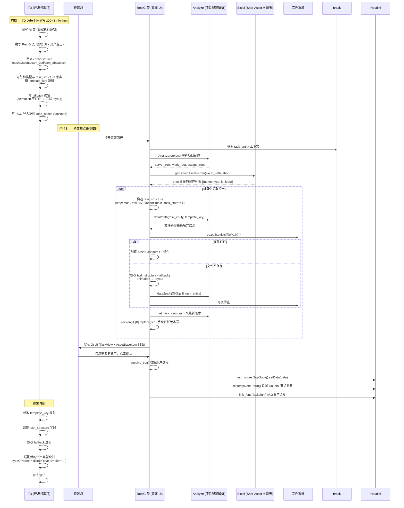
```mermaid
sequenceDiagram
  participant TD as TD (开发领取项)
  participant FX as 特效师
  participant RecIG as RecIG 类 (领取 UI)
  participant Analyze as Analyze (项目配置解析)
  participant Excel as Excel (Shot-Asset 关联表)
  participant Disk as 文件系统
  participant FT as ftrack
  participant DCC as Houdini

  Note over TD: 前期 — TD 为每个环节写 300+ 行 Python
  TD->>TD: 编写 RI 类 (领取执行逻辑)
  TD->>TD: 编写 RecIG 类 (领取 UI + 资产遍历)
  TD->>TD: 定义 cacheListTree<br/>{cache/scene/cam_usd/cam_abc/asset}
  TD->>TD: 为每种类型写 task_structure 字典<br/>和 template_key 映射
  TD->>TD: 写 fallback 逻辑<br/>(animation 不存在 → 尝试 layout)
  TD->>TD: 写 DCC 导入逻辑 (usd_nodes.SopNode)

  Note over FX: 运行时 — 特效师点击"领取"
  FX->>RecIG: 打开领取面板
  RecIG->>FT: 获取 task_entity 上下文
  RecIG->>Analyze: Analyze(project) 解析项目配置
  Analyze-->>RecIG: server_root, work_root, escape_root

  RecIG->>Excel: getLinkedAssetsFrom(excel_path, shot)
  Excel-->>RecIG: shot 关联的资产列表 [{name, type, id, look}]

  loop 对每个关联资产
    RecIG->>RecIG: 构造 task_structure<br/>{step:'mod', task:'uv', variant:'main', task_state:'ok'}
    RecIG->>Analyze: data2path(task_entity, template_key)
    Analyze-->>RecIG: 文件路径模板填充结果

    RecIG->>Disk: os.path.exists(filePath) ?
    alt 文件存在
      RecIG->>RecIG: 创建 AssetBaseItem UI 组件
    else 文件不存在
      RecIG->>RecIG: 修改 task_structure (fallback)<br/>animation → layout
      RecIG->>Analyze: data2path(修改后的 task_entity)
      RecIG->>Disk: 再次检查
    end

    RecIG->>Analyze: get_task_versions() 取最新版本
    RecIG->>RecIG: version[-1][0].replace('v','') 手动解析版本号
  end

  RecIG->>FX: 展示 Qt UI (TaskView + AssetBaseItem 列表)
  FX->>RecIG: 勾选需要的资产，点击确认

  RecIG->>RecIG: receive_set() 收集用户选择
  RecIG->>DCC: usd_nodes.SopNode().setData(data)
  RecIG->>DCC: setTempNodeParm() 设置 Houdini 节点参数
  RecIG->>DCC: link_func.TaskLink() 建立资产链接

  Note over TD: 换项目时
  TD->>TD: 修改 template_key 映射
  TD->>TD: 调整 task_structure 字段
  TD->>TD: 修改 fallback 逻辑
  TD->>TD: 适配新的资产类型映射<br/>typeOfName = dict(c='char',e='elem',...)
  TD->>TD: 回归测试
```

### 2.2 AI Pipeline 发布/领取流程

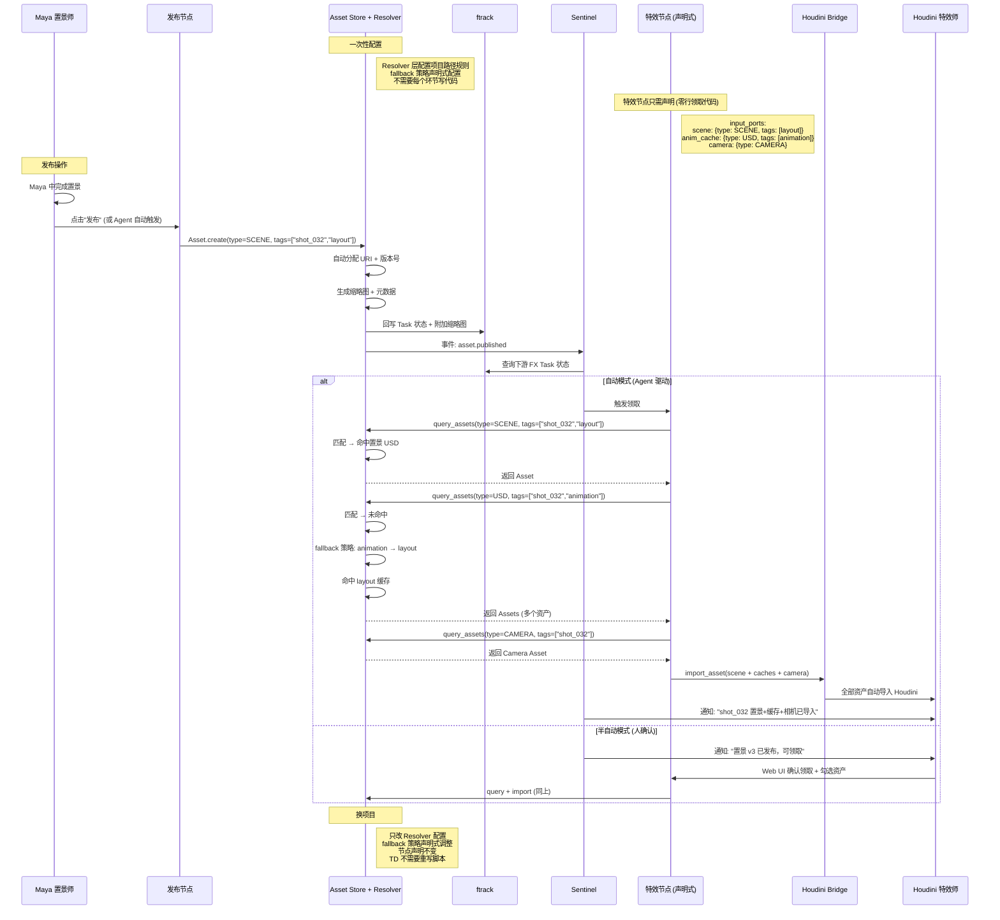
```mermaid
sequenceDiagram
  participant Artist_Pub as Maya 置景师
  participant PubNode as 发布节点
  participant AS as Asset Store + Resolver
  participant FT as ftrack
  participant Sentinel as Sentinel
  participant FXNode as 特效节点 (声明式)
  participant Bridge as Houdini Bridge
  participant Artist_FX as Houdini 特效师

  Note over AS: 一次性配置
  Note right of AS: Resolver 层配置项目路径规则<br/>fallback 策略声明式配置<br/>不需要每个环节写代码

  Note over FXNode: 特效节点只需声明 (零行领取代码)
  Note right of FXNode: input_ports:<br/>  scene: {type: SCENE, tags: [layout]}<br/>  anim_cache: {type: USD, tags: [animation]}<br/>  camera: {type: CAMERA}

  Note over Artist_Pub: 发布操作
  Artist_Pub->>Artist_Pub: Maya 中完成置景
  Artist_Pub->>PubNode: 点击"发布" (或 Agent 自动触发)
  PubNode->>AS: Asset.create(type=SCENE, tags=["shot_032","layout"])
  AS->>AS: 自动分配 URI + 版本号
  AS->>AS: 生成缩略图 + 元数据
  AS->>FT: 回写 Task 状态 + 附加缩略图
  AS->>Sentinel: 事件: asset.published

  Sentinel->>FT: 查询下游 FX Task 状态

  alt 自动模式 (Agent 驱动)
    Sentinel->>FXNode: 触发领取
    FXNode->>AS: query_assets(type=SCENE, tags=["shot_032","layout"])
    AS->>AS: 匹配 → 命中置景 USD
    AS-->>FXNode: 返回 Asset

    FXNode->>AS: query_assets(type=USD, tags=["shot_032","animation"])
    AS->>AS: 匹配 → 未命中
    AS->>AS: fallback 策略: animation → layout
    AS->>AS: 命中 layout 缓存
    AS-->>FXNode: 返回 Assets (多个资产)

    FXNode->>AS: query_assets(type=CAMERA, tags=["shot_032"])
    AS-->>FXNode: 返回 Camera Asset

    FXNode->>Bridge: import_asset(scene + caches + camera)
    Bridge->>Artist_FX: 全部资产自动导入 Houdini
    Sentinel->>Artist_FX: 通知: "shot_032 置景+缓存+相机已导入"

  else 半自动模式 (人确认)
    Sentinel->>Artist_FX: 通知: "置景 v3 已发布，可领取"
    Artist_FX->>FXNode: Web UI 确认领取 + 勾选资产
    FXNode->>AS: query + import (同上)
  end

  Note over AS: 换项目
  Note right of AS: 只改 Resolver 配置<br/>fallback 策略声明式调整<br/>节点声明不变<br/>TD 不需要重写脚本
```

### 2.3 传统 vs AI Pipeline 领取项代码量对比

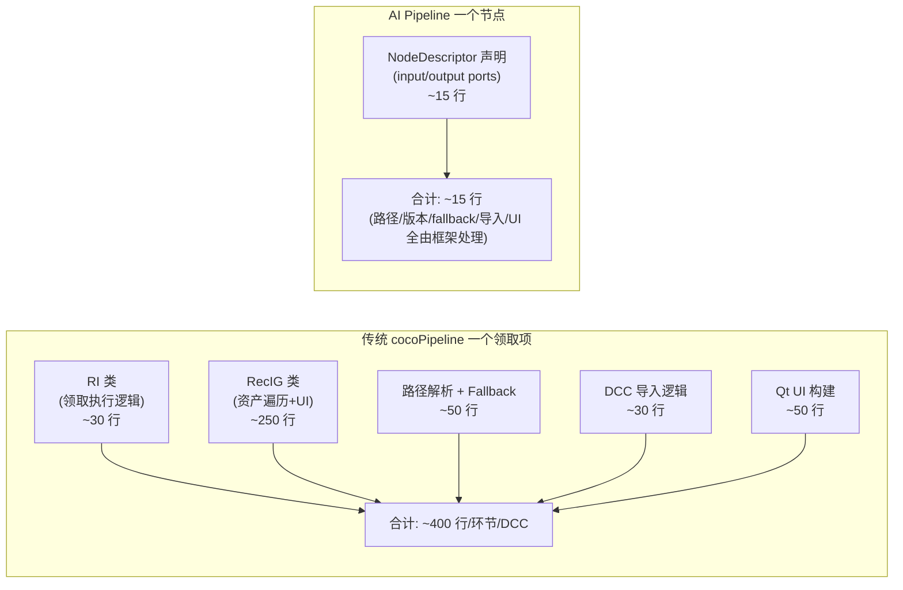
```mermaid
graph LR
  subgraph traditional [传统 cocoPipeline 一个领取项]
    RI_class["RI 类\n(领取执行逻辑)\n~30 行"]
    RecIG_class["RecIG 类\n(资产遍历+UI)\n~250 行"]
    YAML_parse["路径解析 + Fallback\n~50 行"]
    DCC_import["DCC 导入逻辑\n~30 行"]
    UI_build["Qt UI 构建\n~50 行"]
    Total_trad["合计: ~400 行/环节/DCC"]
  end

  subgraph ai [AI Pipeline 一个节点]
    Descriptor["NodeDescriptor 声明\n(input/output ports)\n~15 行"]
    Total_ai["合计: ~15 行\n(路径/版本/fallback/导入/UI 全由框架处理)"]
  end

  RI_class --> Total_trad
  RecIG_class --> Total_trad
  YAML_parse --> Total_trad
  DCC_import --> Total_trad
  UI_build --> Total_trad

  Descriptor --> Total_ai
```

---

## 3. 数据流转详细图 — Asset 生命周期

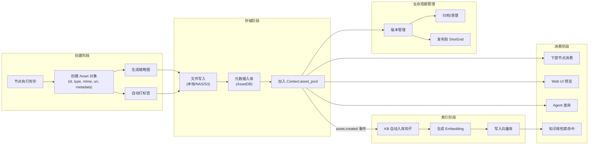
```mermaid
flowchart LR
  subgraph creation [创建阶段]
    NodeExec["节点执行完毕"]
    CreateAsset["创建 Asset 对象\n(id, type, mime, uri, metadata)"]
    GenThumb["生成缩略图"]
    AutoTag["自动打标签"]
  end

  subgraph storage [存储阶段]
    FileWrite["文件写入\n(本地/NAS/S3)"]
    DBWrite["元数据入库\n(AssetDB)"]
    PoolAdd["加入 Context.asset_pool"]
  end

  subgraph indexing [索引阶段]
    KBHook["KB 自动入库钩子"]
    Embedding["生成 Embedding"]
    VectorWrite["写入向量库"]
  end

  subgraph consumption [消费阶段]
    NextNode["下游节点消费"]
    UIPreview["Web UI 预览"]
    AgentQuery["Agent 查询"]
    KBRecall["知识库检索命中"]
  end

  subgraph lifecycle [生命周期管理]
    Version["版本管理"]
    Archive["归档/清理"]
    Export["发布到 ShotGrid"]
  end

  NodeExec --> CreateAsset
  CreateAsset --> GenThumb
  CreateAsset --> AutoTag
  GenThumb --> FileWrite
  AutoTag --> FileWrite
  FileWrite --> DBWrite
  DBWrite --> PoolAdd

  PoolAdd -->|"asset.created 事件"| KBHook
  KBHook --> Embedding
  Embedding --> VectorWrite

  PoolAdd --> NextNode
  PoolAdd --> UIPreview
  PoolAdd --> AgentQuery
  VectorWrite --> KBRecall

  PoolAdd --> Version
  Version --> Archive
  Version --> Export
```

---

## 3. Port 类型系统 — 节点兼容性矩阵

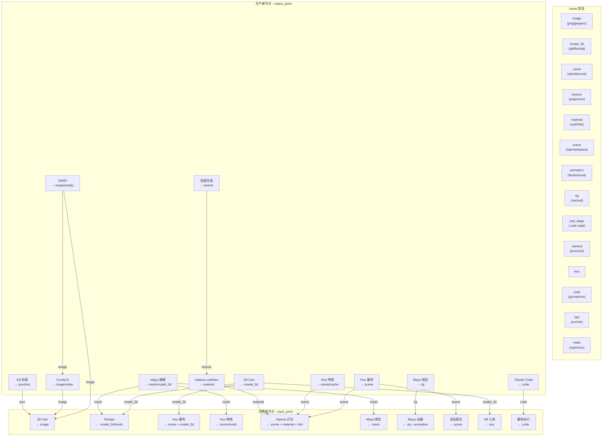
```mermaid
flowchart TD
  subgraph assetTypes [Asset 类型]
    IMG["image\n(png/jpeg/exr)"]
    M3D["model_3d\n(glb/fbx/obj)"]
    MESH["mesh\n(alembic/usd)"]
    TEX["texture\n(png/exr/tx)"]
    MAT["material\n(usd/mtlx)"]
    SCN["scene\n(hip/ma/katana)"]
    ANIM["animation\n(fbx/bvh/usd)"]
    RIG["rig\n(ma/usd)"]
    USD["usd_stage\n(.usd/.usda)"]
    CAM["camera\n(json/usd)"]
    TXT["text"]
    CODE["code\n(py/mel/vex)"]
    HDRI["hdri\n(exr/hdr)"]
    VID["video\n(mp4/mov)"]
  end

  subgraph producers [生产者节点 - output_ports]
    SAM3_out["SAM3\n→ image(mask)"]
    Gen3D_out["3D Gen\n→ model_3d"]
    ComfyUI_out["ComfyUI\n→ image/video"]
    HouScat_out["Hou 散布\n→ scene"]
    HouFX_out["Hou 特效\n→ scene/cache"]
    MayaModel_out["Maya 建模\n→ mesh/model_3d"]
    MayaRig_out["Maya 绑定\n→ rig"]
    KatanaLook_out["Katana LookDev\n→ material"]
    ClaudeCode_out["Claude Code\n→ code"]
    KBSearch_out["KB 检索\n→ json/text"]
    TexGen_out["贴图生成\n→ texture"]
  end

  subgraph consumers [消费者节点 - input_ports]
    Gen3D_in["3D Gen\n← image"]
    Retopo_in["Retopo\n← model_3d/mesh"]
    HouScat_in["Hou 散布\n← scene + model_3d"]
    HouFX_in["Hou 特效\n← scene/mesh"]
    KatanaLight_in["Katana 灯光\n← scene + material + hdri"]
    MayaRig_in["Maya 绑定\n← mesh"]
    MayaAnim_in["Maya 动画\n← rig + animation"]
    Render_in["渲染提交\n← scene"]
    KBIngest_in["KB 入库\n← any"]
    ScriptRun_in["脚本执行\n← code"]
  end

  SAM3_out -->|"image"| Gen3D_in
  SAM3_out -->|"image"| ComfyUI_out
  Gen3D_out -->|"model_3d"| Retopo_in
  Gen3D_out -->|"model_3d"| HouScat_in
  Gen3D_out -->|"model_3d"| KBIngest_in
  MayaModel_out -->|"mesh"| MayaRig_in
  MayaModel_out -->|"mesh"| Retopo_in
  MayaModel_out -->|"mesh"| HouFX_in
  MayaRig_out -->|"rig"| MayaAnim_in
  HouScat_out -->|"scene"| KatanaLight_in
  HouScat_out -->|"scene"| Render_in
  HouFX_out -->|"scene"| KatanaLight_in
  KatanaLook_out -->|"material"| KatanaLight_in
  TexGen_out -->|"texture"| KatanaLook_out
  ComfyUI_out -->|"image"| Gen3D_in
  ClaudeCode_out -->|"code"| ScriptRun_in
  KBSearch_out -->|"json"| Gen3D_in
```

---

## 4. DCC Bridge 通信详细图

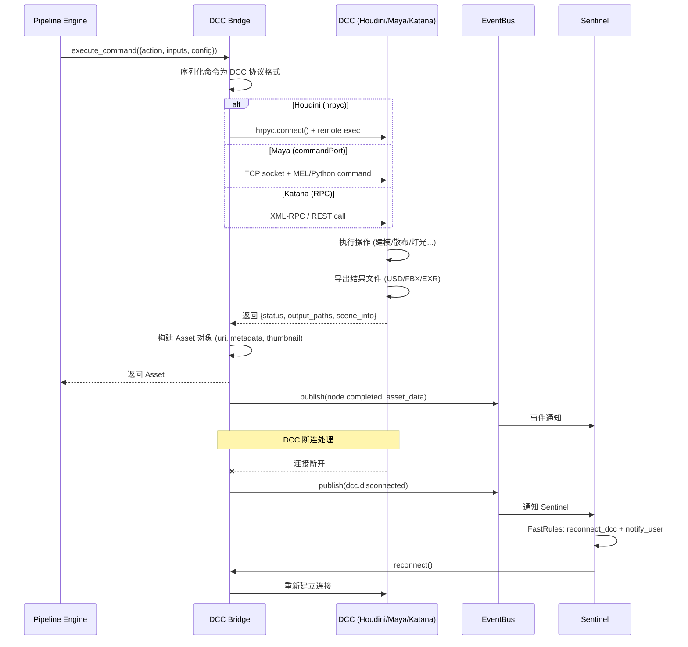
```mermaid
sequenceDiagram
  participant P as Pipeline Engine
  participant B as DCC Bridge
  participant D as DCC (Houdini/Maya/Katana)
  participant E as EventBus
  participant S as Sentinel

  P->>B: execute_command({action, inputs, config})
  B->>B: 序列化命令为 DCC 协议格式

  alt Houdini (hrpyc)
    B->>D: hrpyc.connect() + remote exec
  else Maya (commandPort)
    B->>D: TCP socket + MEL/Python command
  else Katana (RPC)
    B->>D: XML-RPC / REST call
  end

  D->>D: 执行操作 (建模/散布/灯光...)
  D->>D: 导出结果文件 (USD/FBX/EXR)

  D-->>B: 返回 {status, output_paths, scene_info}
  B->>B: 构建 Asset 对象 (uri, metadata, thumbnail)
  B-->>P: 返回 Asset

  B->>E: publish(node.completed, asset_data)
  E->>S: 事件通知

  Note over D,B: DCC 断连处理
  D--xB: 连接断开
  B->>E: publish(dcc.disconnected)
  E->>S: 通知 Sentinel
  S->>S: FastRules: reconnect_dcc + notify_user
  S->>B: reconnect()
  B->>D: 重新建立连接
```

---

## 5. ComfyUI Sidecar Bridge 详细图

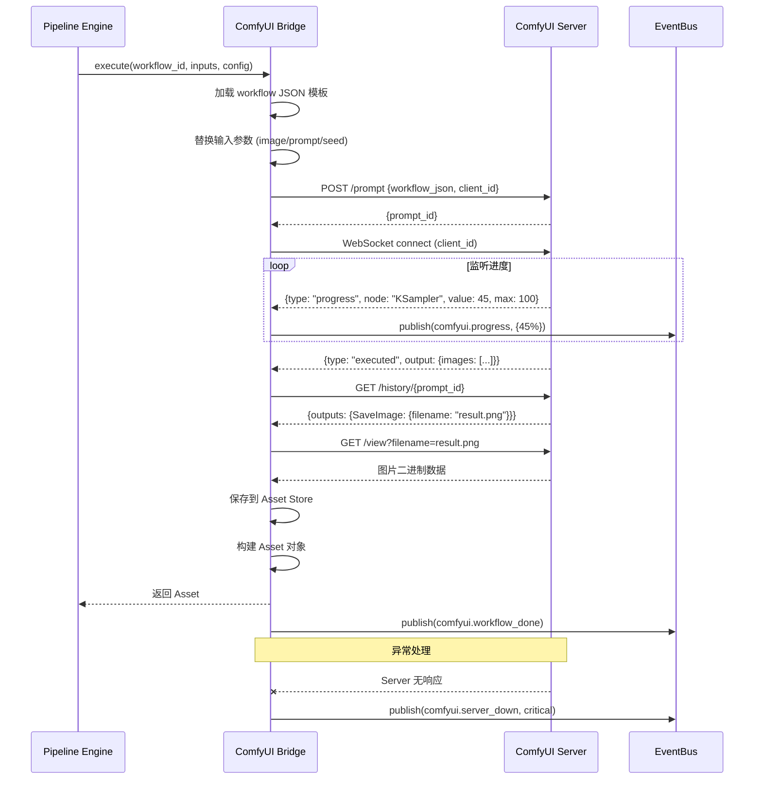
```mermaid
sequenceDiagram
  participant P as Pipeline Engine
  participant CB as ComfyUI Bridge
  participant C as ComfyUI Server
  participant E as EventBus

  P->>CB: execute(workflow_id, inputs, config)
  CB->>CB: 加载 workflow JSON 模板
  CB->>CB: 替换输入参数 (image/prompt/seed)

  CB->>C: POST /prompt {workflow_json, client_id}
  C-->>CB: {prompt_id}

  CB->>C: WebSocket connect (client_id)

  loop 监听进度
    C-->>CB: {type: "progress", node: "KSampler", value: 45, max: 100}
    CB->>E: publish(comfyui.progress, {45%})
  end

  C-->>CB: {type: "executed", output: {images: [...]}}

  CB->>C: GET /history/{prompt_id}
  C-->>CB: {outputs: {SaveImage: {filename: "result.png"}}}

  CB->>C: GET /view?filename=result.png
  C-->>CB: 图片二进制数据

  CB->>CB: 保存到 Asset Store
  CB->>CB: 构建 Asset 对象
  CB-->>P: 返回 Asset

  CB->>E: publish(comfyui.workflow_done)

  Note over C,CB: 异常处理
  C--xCB: Server 无响应
  CB->>E: publish(comfyui.server_down, critical)
```

---

## 6. Sentinel 守护 Agent 决策流程

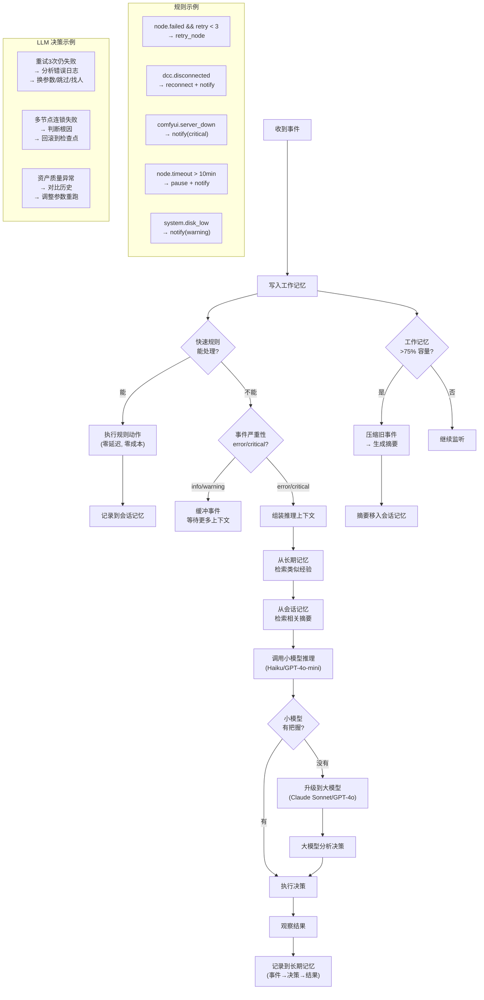
```mermaid
flowchart TD
  EventIn["收到事件"] --> WriteMemory["写入工作记忆"]

  WriteMemory --> CheckRules{"快速规则\n能处理?"}

  CheckRules -->|"能"| ExecRule["执行规则动作\n(零延迟, 零成本)"]
  ExecRule --> LogAction["记录到会话记忆"]

  CheckRules -->|"不能"| CheckSeverity{"事件严重性\nerror/critical?"}

  CheckSeverity -->|"info/warning"| BufferEvent["缓冲事件\n等待更多上下文"]
  CheckSeverity -->|"error/critical"| BuildContext["组装推理上下文"]

  BuildContext --> RecallLTM["从长期记忆\n检索类似经验"]
  RecallLTM --> RecallSession["从会话记忆\n检索相关摘要"]
  RecallSession --> CallSmallLLM["调用小模型推理\n(Haiku/GPT-4o-mini)"]

  CallSmallLLM --> ParseDecision{"小模型\n有把握?"}

  ParseDecision -->|"有"| ExecDecision["执行决策"]
  ExecDecision --> Observe["观察结果"]
  Observe --> Learn["记录到长期记忆\n(事件→决策→结果)"]

  ParseDecision -->|"没有"| Escalate["升级到大模型\n(Claude Sonnet/GPT-4o)"]
  Escalate --> BigModelDecision["大模型分析决策"]
  BigModelDecision --> ExecDecision

  WriteMemory --> CheckCapacity{"工作记忆\n>75% 容量?"}
  CheckCapacity -->|"是"| Compact["压缩旧事件\n→ 生成摘要"]
  Compact --> MoveToSession["摘要移入会话记忆"]
  CheckCapacity -->|"否"| Continue["继续监听"]

  subgraph ruleExamples [规则示例]
    R1["node.failed && retry < 3\n→ retry_node"]
    R2["dcc.disconnected\n→ reconnect + notify"]
    R3["comfyui.server_down\n→ notify(critical)"]
    R4["node.timeout > 10min\n→ pause + notify"]
    R5["system.disk_low\n→ notify(warning)"]
  end

  subgraph llmDecisions [LLM 决策示例]
    D1["重试3次仍失败\n→ 分析错误日志\n→ 换参数/跳过/找人"]
    D2["多节点连锁失败\n→ 判断根因\n→ 回滚到检查点"]
    D3["资产质量异常\n→ 对比历史\n→ 调整参数重跑"]
  end
```

---

## 7. 三层记忆系统详细图

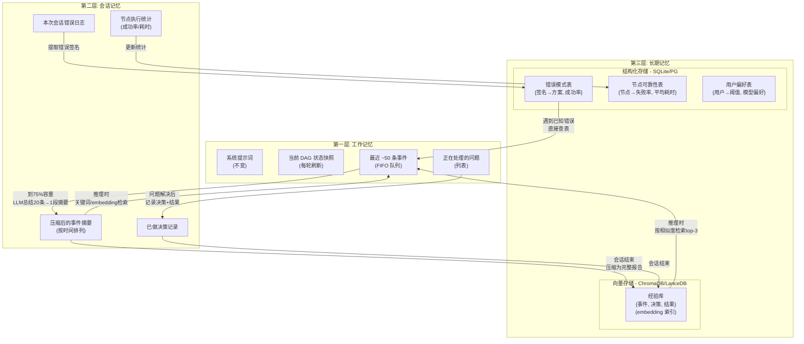
```mermaid
flowchart TB
  subgraph working [第一层: 工作记忆]
    direction LR
    SysPrompt["系统提示词\n(不变)"]
    StateSnap["当前 DAG 状态快照\n(每轮刷新)"]
    RecentEvents["最近 ~50 条事件\n(FIFO 队列)"]
    ActiveIssues["正在处理的问题\n(列表)"]
  end

  subgraph session [第二层: 会话记忆]
    direction LR
    Summaries["压缩后的事件摘要\n(按时间排列)"]
    ErrorLog["本次会话错误日志"]
    NodeStats["节点执行统计\n(成功率/耗时)"]
    Decisions["已做决策记录"]
  end

  subgraph longterm [第三层: 长期记忆]
    direction LR
    subgraph structured [结构化存储 - SQLite/PG]
      ErrorPatterns["错误模式表\n{签名→方案, 成功率}"]
      NodeReliability["节点可靠性表\n{节点→失败率, 平均耗时}"]
      UserPrefs["用户偏好表\n{用户→阈值, 模型偏好}"]
    end
    subgraph vector [向量存储 - ChromaDB/LanceDB]
      ExperienceStore["经验库\n{事件, 决策, 结果}\n(embedding 索引)"]
    end
  end

  RecentEvents -->|"到75%容量\nLLM总结20条→1段摘要"| Summaries
  Summaries -->|"会话结束\n压缩为完整报告"| ExperienceStore

  ExperienceStore -->|"推理时\n按相似度检索top-3"| RecentEvents
  Summaries -->|"推理时\n关键词/embedding检索"| RecentEvents
  ErrorPatterns -->|"遇到已知错误\n直接查表"| RecentEvents

  ActiveIssues -->|"问题解决后\n记录决策+结果"| Decisions
  Decisions -->|"会话结束"| ExperienceStore

  ErrorLog -->|"提取错误签名"| ErrorPatterns
  NodeStats -->|"更新统计"| NodeReliability
```

---

## 8. Agent 编排交互图

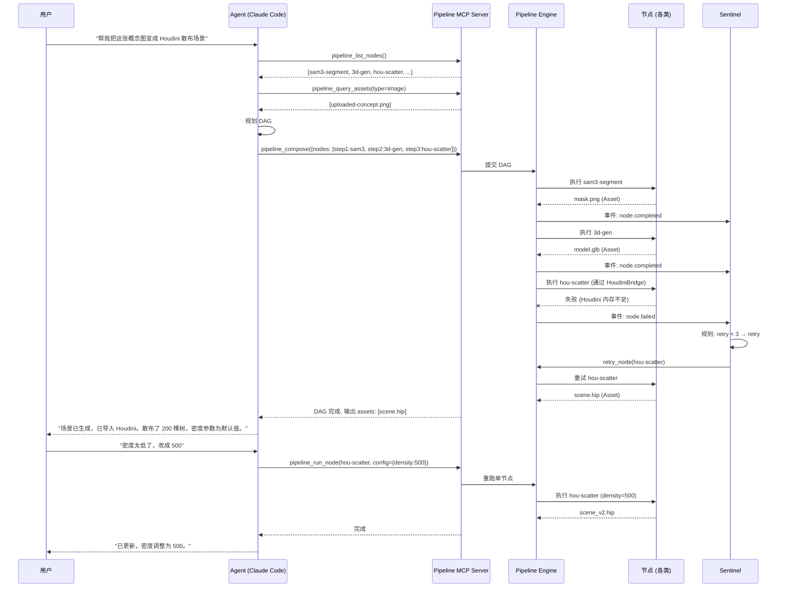
```mermaid
sequenceDiagram
  participant U as 用户
  participant A as Agent (Claude Code)
  participant MCP as Pipeline MCP Server
  participant E as Pipeline Engine
  participant N as 节点 (各类)
  participant S as Sentinel

  U->>A: "帮我把这张概念图变成 Houdini 散布场景"
  A->>MCP: pipeline_list_nodes()
  MCP-->>A: [sam3-segment, 3d-gen, hou-scatter, ...]

  A->>MCP: pipeline_query_assets(type=image)
  MCP-->>A: [uploaded-concept.png]

  A->>A: 规划 DAG

  A->>MCP: pipeline_compose({nodes: [step1:sam3, step2:3d-gen, step3:hou-scatter]})
  MCP->>E: 提交 DAG

  E->>N: 执行 sam3-segment
  N-->>E: mask.png (Asset)
  E->>S: 事件: node.completed

  E->>N: 执行 3d-gen
  N-->>E: model.glb (Asset)
  E->>S: 事件: node.completed

  E->>N: 执行 hou-scatter (通过 HoudiniBridge)
  N--xE: 失败 (Houdini 内存不足)
  E->>S: 事件: node.failed

  S->>S: 规则: retry < 3 → retry
  S->>E: retry_node(hou-scatter)
  E->>N: 重试 hou-scatter
  N-->>E: scene.hip (Asset)

  MCP-->>A: DAG 完成, 输出 assets: [scene.hip]
  A-->>U: "场景已生成，已导入 Houdini。散布了 200 棵树，密度参数为默认值。"

  U->>A: "密度太低了，改成 500"
  A->>MCP: pipeline_run_node(hou-scatter, config={density:500})
  MCP->>E: 重跑单节点
  E->>N: 执行 hou-scatter (density=500)
  N-->>E: scene_v2.hip
  MCP-->>A: 完成
  A-->>U: "已更新，密度调整为 500。"
```

---

## 9. 完整端到端案例 — "概念图到最终渲染"

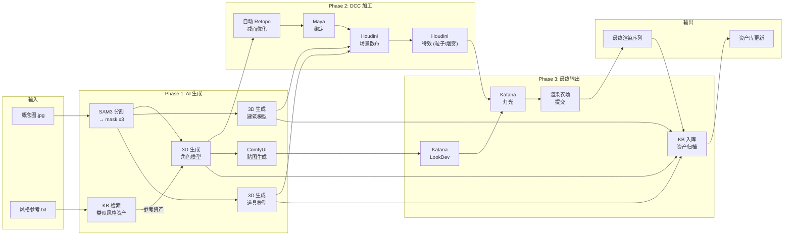
```mermaid
flowchart LR
  subgraph input [输入]
    ConceptArt["概念图.jpg"]
    StyleRef["风格参考.txt"]
  end

  subgraph phase1 [Phase 1: AI 生成]
    SAM3["SAM3 分割\n→ mask x3"]
    KBSearch["KB 检索\n类似风格资产"]
    Gen3D_1["3D 生成\n角色模型"]
    Gen3D_2["3D 生成\n建筑模型"]
    Gen3D_3["3D 生成\n道具模型"]
    TexGen["ComfyUI\n贴图生成"]
  end

  subgraph phase2 [Phase 2: DCC 加工]
    Retopo["自动 Retopo\n减面优化"]
    MayaRig["Maya\n绑定"]
    HouScatter["Houdini\n场景散布"]
    HouFX["Houdini\n特效 (粒子/烟雾)"]
  end

  subgraph phase3 [Phase 3: 最终输出]
    KatanaLook["Katana\nLookDev"]
    KatanaLight["Katana\n灯光"]
    RenderSubmit["渲染农场\n提交"]
    KBIngest["KB 入库\n资产归档"]
  end

  subgraph output [输出]
    FinalRender["最终渲染序列"]
    AssetLib["资产库更新"]
  end

  ConceptArt --> SAM3
  StyleRef --> KBSearch

  SAM3 --> Gen3D_1
  SAM3 --> Gen3D_2
  SAM3 --> Gen3D_3
  KBSearch -->|"参考资产"| Gen3D_1

  Gen3D_1 --> Retopo
  Gen3D_1 --> TexGen
  Gen3D_2 --> HouScatter
  Gen3D_3 --> HouScatter

  Retopo --> MayaRig
  TexGen --> KatanaLook

  MayaRig --> HouScatter
  HouScatter --> HouFX
  HouFX --> KatanaLight
  KatanaLook --> KatanaLight
  KatanaLight --> RenderSubmit

  RenderSubmit --> FinalRender

  Gen3D_1 --> KBIngest
  Gen3D_2 --> KBIngest
  Gen3D_3 --> KBIngest
  FinalRender --> KBIngest
  KBIngest --> AssetLib
```

---

## 10. 项目目录结构与模块关系图

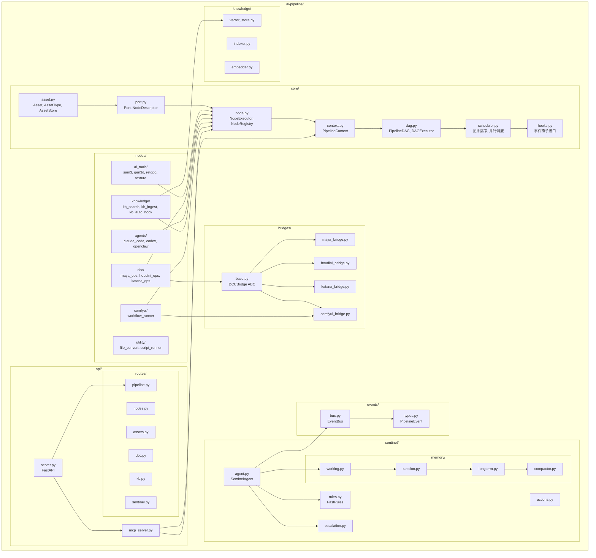
```mermaid
graph TD
  subgraph root ["ai-pipeline/"]
    subgraph coreModule ["core/"]
      Asset["asset.py\nAsset, AssetType, AssetStore"]
      Port["port.py\nPort, NodeDescriptor"]
      Node["node.py\nNodeExecutor, NodeRegistry"]
      Ctx["context.py\nPipelineContext"]
      DAG["dag.py\nPipelineDAG, DAGExecutor"]
      Sched["scheduler.py\n拓扑排序, 并行调度"]
      Hooks["hooks.py\n事件钩子接口"]
    end

    subgraph eventsModule ["events/"]
      Bus["bus.py\nEventBus"]
      Types["types.py\nPipelineEvent"]
    end

    subgraph sentinelModule ["sentinel/"]
      Agent["agent.py\nSentinelAgent"]
      subgraph memModule ["memory/"]
        WMem["working.py"]
        SMem["session.py"]
        LMem["longterm.py"]
        Compactor["compactor.py"]
      end
      Rules["rules.py\nFastRules"]
      Actions["actions.py"]
      Escal["escalation.py"]
    end

    subgraph bridgesModule ["bridges/"]
      BBase["base.py\nDCCBridge ABC"]
      BMaya["maya_bridge.py"]
      BHou["houdini_bridge.py"]
      BKat["katana_bridge.py"]
      BComfy["comfyui_bridge.py"]
    end

    subgraph nodesModule ["nodes/"]
      AINodes["ai_tools/\nsam3, gen3d, retopo, texture"]
      DCCNodes["dcc/\nmaya_ops, houdini_ops, katana_ops"]
      AgentNodes["agents/\nclaude_code, codex, openclaw"]
      KBNodes["knowledge/\nkb_search, kb_ingest, kb_auto_hook"]
      ComfyNodes["comfyui/\nworkflow_runner"]
      UtilNodes["utility/\nfile_convert, script_runner"]
    end

    subgraph apiModule ["api/"]
      Server["server.py\nFastAPI"]
      subgraph routesModule ["routes/"]
        RPipeline["pipeline.py"]
        RNodes["nodes.py"]
        RAssets["assets.py"]
        RDCC["dcc.py"]
        RKB["kb.py"]
        RSentinel["sentinel.py"]
      end
      MCPServer["mcp_server.py"]
    end

    subgraph kbModule ["knowledge/"]
      VecStore["vector_store.py"]
      Indexer["indexer.py"]
      Embedder["embedder.py"]
    end
  end

  Asset --> Port
  Port --> Node
  Node --> Ctx
  Ctx --> DAG
  DAG --> Sched
  Sched --> Hooks

  Bus --> Types
  Agent --> Bus
  Agent --> WMem
  Agent --> Rules
  Agent --> Escal
  WMem --> SMem
  SMem --> LMem
  LMem --> Compactor

  BBase --> BMaya
  BBase --> BHou
  BBase --> BKat
  BBase --> BComfy

  AINodes --> Node
  DCCNodes --> Node
  DCCNodes --> BBase
  AgentNodes --> Node
  KBNodes --> Node
  KBNodes --> VecStore
  ComfyNodes --> Node
  ComfyNodes --> BComfy

  Server --> RPipeline
  Server --> MCPServer
  MCPServer --> Node
  MCPServer --> Ctx
```

---

## 11. 分阶段实施路线图

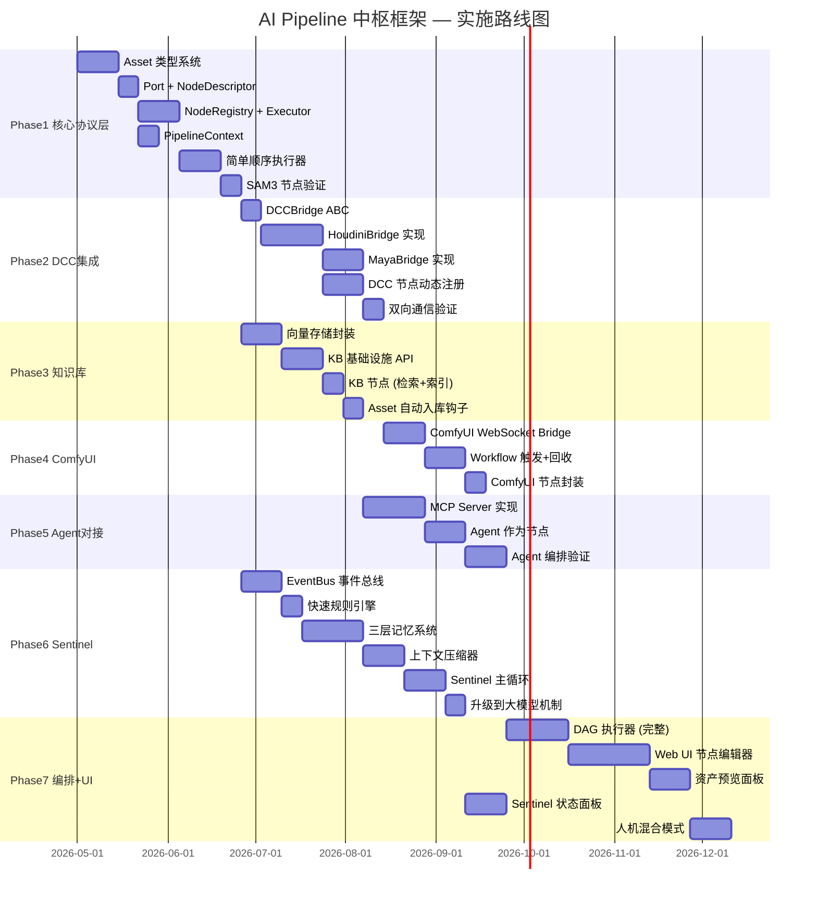
```mermaid
gantt
  title AI Pipeline 中枢框架 — 实施路线图
  dateFormat YYYY-MM

  section Phase1 核心协议层
    Asset 类型系统             :p1a, 2026-05, 2w
    Port + NodeDescriptor      :p1b, after p1a, 1w
    NodeRegistry + Executor    :p1c, after p1b, 2w
    PipelineContext            :p1d, after p1b, 1w
    简单顺序执行器             :p1e, after p1c, 2w
    SAM3 节点验证              :p1f, after p1e, 1w

  section Phase2 DCC集成
    DCCBridge ABC              :p2a, after p1f, 1w
    HoudiniBridge 实现         :p2b, after p2a, 3w
    MayaBridge 实现            :p2c, after p2b, 2w
    DCC 节点动态注册           :p2d, after p2b, 2w
    双向通信验证               :p2e, after p2d, 1w

  section Phase3 知识库
    向量存储封装               :p3a, after p1f, 2w
    KB 基础设施 API            :p3b, after p3a, 2w
    KB 节点 (检索+索引)        :p3c, after p3b, 1w
    Asset 自动入库钩子         :p3d, after p3c, 1w

  section Phase4 ComfyUI
    ComfyUI WebSocket Bridge   :p4a, after p2e, 2w
    Workflow 触发+回收         :p4b, after p4a, 2w
    ComfyUI 节点封装           :p4c, after p4b, 1w

  section Phase5 Agent对接
    MCP Server 实现            :p5a, after p3d, 3w
    Agent 作为节点             :p5b, after p5a, 2w
    Agent 编排验证             :p5c, after p5b, 2w

  section Phase6 Sentinel
    EventBus 事件总线          :p6a, after p1f, 2w
    快速规则引擎               :p6b, after p6a, 1w
    三层记忆系统               :p6c, after p6b, 3w
    上下文压缩器               :p6d, after p6c, 2w
    Sentinel 主循环            :p6e, after p6d, 2w
    升级到大模型机制           :p6f, after p6e, 1w

  section Phase7 编排+UI
    DAG 执行器 (完整)          :p7a, after p5c, 3w
    Web UI 节点编辑器          :p7b, after p7a, 4w
    资产预览面板               :p7c, after p7b, 2w
    Sentinel 状态面板          :p7d, after p6f, 2w
    人机混合模式               :p7e, after p7c, 2w
```

---

## 12. 网络拓扑 — 部署架构图

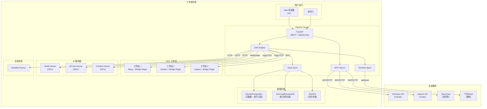
```mermaid
graph TB
  subgraph studio [工作室网络]
    subgraph pipelineServer [Pipeline Server]
      FastAPI["FastAPI\n(REST + WebSocket)"]
      MCPSrv["MCP Server"]
      SentinelProc["Sentinel Agent"]
      DAGEngine["DAG Engine"]
      AssetStoreProc["Asset Store"]
    end

    subgraph databases [数据存储]
      SQLite["SQLite/PostgreSQL\n(元数据 + 执行记录)"]
      VectorDB["ChromaDB/LanceDB\n(知识库向量)"]
      NAS["NAS/S3\n(文件存储)"]
    end

    subgraph dccMachines [DCC 工作站]
      W1["工作站 1\nMaya + Bridge Plugin"]
      W2["工作站 2\nHoudini + Bridge Plugin"]
      W3["工作站 3\nKatana + Bridge Plugin"]
    end

    subgraph aiServers [AI 服务器]
      SAM3Srv["SAM3 Server\n(GPU)"]
      Gen3DSrv["3D Gen Server\n(GPU)"]
      ComfySrv["ComfyUI Server\n(GPU)"]
    end

    subgraph renderFarm [渲染农场]
      Deadline["Deadline/Tractor"]
    end

    subgraph userAccess [用户访问]
      Browser["Web 浏览器\n(UI)"]
      CLI["命令行"]
    end
  end

  subgraph external [外部服务]
    Anthropic["Anthropic API\n(Claude)"]
    OpenAI["OpenAI API\n(Codex)"]
    OpenClawSrv["OpenClaw\n(自托管)"]
    Notify["飞书/Slack\n(通知)"]
  end

  Browser --> FastAPI
  CLI --> FastAPI
  FastAPI --> DAGEngine
  FastAPI --> MCPSrv
  DAGEngine --> SentinelProc
  DAGEngine --> AssetStoreProc

  AssetStoreProc --> SQLite
  AssetStoreProc --> VectorDB
  AssetStoreProc --> NAS

  DAGEngine -->|"hrpyc/TCP"| W1
  DAGEngine -->|"hrpyc/TCP"| W2
  DAGEngine -->|"RPC"| W3

  DAGEngine -->|"HTTP"| SAM3Srv
  DAGEngine -->|"HTTP"| Gen3DSrv
  DAGEngine -->|"WebSocket"| ComfySrv
  DAGEngine -->|"HTTP"| Deadline

  MCPSrv -->|"MCP/HTTP"| Anthropic
  MCPSrv -->|"MCP/HTTP"| OpenAI
  MCPSrv -->|"MCP/HTTP"| OpenClawSrv

  SentinelProc -->|"webhook"| Notify
```

---

## 13. 大数据可视化 — 生产驾驶舱架构图

```mermaid
graph TB
  subgraph dataSources [数据源]
    PipelineEngine["Pipeline Engine\n(DAG 执行数据)"]
    SentinelData["Sentinel\n(事件流 + 决策日志)"]
    AssetStoreData["Asset Store\n(资产元数据)"]
    DCCBridgeData["DCC Bridge\n(工作站状态)"]
    FtrackAPI["ftrack API\n(任务/Shot/资产状态)"]
    JiraAPI["Jira API\n(需求/Bug)"]
    USDResolver["USD Asset Resolver\n(Stage 组合信息)"]
    ResourceMon["资源监控\n(GPU/CPU/磁盘)"]
    RenderFarm["渲染农场\n(Deadline/Tractor)"]
  end

  subgraph dataLayer [数据采集与聚合层]
    EventCollector["事件收集器\n(统一格式化)"]
    MetricsAgg["指标聚合器\n(时序数据)"]
    SnapshotGen["快照生成器\n(定期 USD Stage 快照)"]
  end

  subgraph storage [存储层]
    TimeSeriesDB["时序数据库\n(InfluxDB/Prometheus)\n节点耗时/资源指标"]
    RelationalDB["关系数据库\n(PostgreSQL)\n项目/Shot/Task 状态"]
    GraphDB["图数据库 (可选)\n(Neo4j)\n资产依赖关系"]
  end

  subgraph vizEngine [可视化引擎]
    subgraph realtime [实时面板]
      PipelineTopo["Pipeline 实时拓扑图\n(节点图 + 状态)"]
      HeatMap["数据流热力图\n(Bridge 通信频率)"]
      EventStream["Sentinel 事件流\n(实时滚动)"]
      ResourceGauge["资源仪表盘\n(GPU/CPU/磁盘)"]
    end

    subgraph project [项目面板]
      ShotBoard["Shot 进度看板\n(各环节完成率)"]
      BurnDown["里程碑燃尽图"]
      TeamLoad["团队工作负载"]
      AssetHealth["资产健康度"]
    end

    subgraph shotDetail [镜头面板]
      USDPreview["USD Stage 预览\n(Hydra Web 渲染)"]
      DepGraph["资产依赖图\n(谁引用了谁)"]
      LayerStack["USD Layer 堆叠\n可视化"]
      VersionDiff["版本差异对比"]
    end

    subgraph analytics [分析面板]
      Timeline["节点执行时间线\n(甘特图)"]
      Reliability["节点可靠性排行"]
      CostTracker["成本追踪\n(GPU时长/API调用)"]
      PredictPanel["预测分析\n(延期风险/瓶颈)"]
    end
  end

  subgraph frontend [前端]
    WebDash["Web Dashboard\n(React + WebSocket)"]
    MobileDash["移动端\n(制片人)"]
    TVScreen["大屏展示\n(工作室墙面)"]
  end

  PipelineEngine --> EventCollector
  SentinelData --> EventCollector
  AssetStoreData --> EventCollector
  DCCBridgeData --> EventCollector
  FtrackAPI --> MetricsAgg
  JiraAPI --> MetricsAgg
  USDResolver --> SnapshotGen
  ResourceMon --> MetricsAgg
  RenderFarm --> MetricsAgg

  EventCollector --> TimeSeriesDB
  MetricsAgg --> TimeSeriesDB
  MetricsAgg --> RelationalDB
  SnapshotGen --> RelationalDB

  TimeSeriesDB --> PipelineTopo
  TimeSeriesDB --> HeatMap
  TimeSeriesDB --> EventStream
  TimeSeriesDB --> ResourceGauge
  TimeSeriesDB --> Timeline
  TimeSeriesDB --> Reliability
  TimeSeriesDB --> CostTracker

  RelationalDB --> ShotBoard
  RelationalDB --> BurnDown
  RelationalDB --> TeamLoad
  RelationalDB --> AssetHealth
  RelationalDB --> USDPreview
  RelationalDB --> DepGraph
  RelationalDB --> LayerStack
  RelationalDB --> VersionDiff
  RelationalDB --> PredictPanel

  PipelineTopo --> WebDash
  ShotBoard --> WebDash
  USDPreview --> WebDash
  Timeline --> WebDash

  ShotBoard --> MobileDash
  BurnDown --> MobileDash
  EventStream --> MobileDash

  PipelineTopo --> TVScreen
  ShotBoard --> TVScreen
  ResourceGauge --> TVScreen
```

---

## 14. USD 深度融合架构图

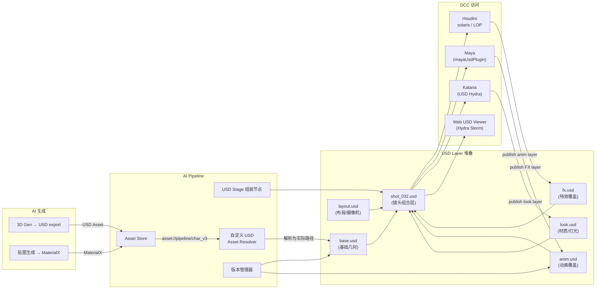
```mermaid
graph LR
  subgraph pipeline [AI Pipeline]
    AssetStore["Asset Store"]
    USDNode["USD Stage 组装节点"]
    Resolver["自定义 USD\nAsset Resolver"]
    VersionMgr["版本管理器"]
  end

  subgraph usdStack [USD Layer 堆叠]
    BaseLayer["base.usd\n(基础几何)"]
    AnimLayer["anim.usd\n(动画覆盖)"]
    FXLayer["fx.usd\n(特效覆盖)"]
    LookLayer["look.usd\n(材质/灯光)"]
    LayoutLayer["layout.usd\n(布局/摄像机)"]
    ShotLayer["shot_032.usd\n(镜头组合层)"]
  end

  subgraph dcc [DCC 访问]
    Houdini["Houdini\nsolaris / LOP"]
    Maya["Maya\n(mayaUsdPlugin)"]
    Katana["Katana\n(USD Hydra)"]
    WebViewer["Web USD Viewer\n(Hydra Storm)"]
  end

  subgraph aiTools [AI 生成]
    Gen3D["3D Gen → USD export"]
    TexGen["贴图生成 → MaterialX"]
  end

  AssetStore -->|"asset://pipeline/char_v3"| Resolver
  Resolver -->|"解析为实际路径"| BaseLayer
  USDNode --> ShotLayer
  VersionMgr --> BaseLayer
  VersionMgr --> AnimLayer

  BaseLayer --> ShotLayer
  AnimLayer --> ShotLayer
  FXLayer --> ShotLayer
  LookLayer --> ShotLayer
  LayoutLayer --> ShotLayer

  ShotLayer --> Houdini
  ShotLayer --> Maya
  ShotLayer --> Katana
  ShotLayer --> WebViewer

  Gen3D -->|"USD Asset"| AssetStore
  TexGen -->|"MaterialX"| AssetStore

  Houdini -->|"publish FX layer"| FXLayer
  Maya -->|"publish anim layer"| AnimLayer
  Katana -->|"publish look layer"| LookLayer
```

---

## 15. ftrack / Jira 双向联动流程图

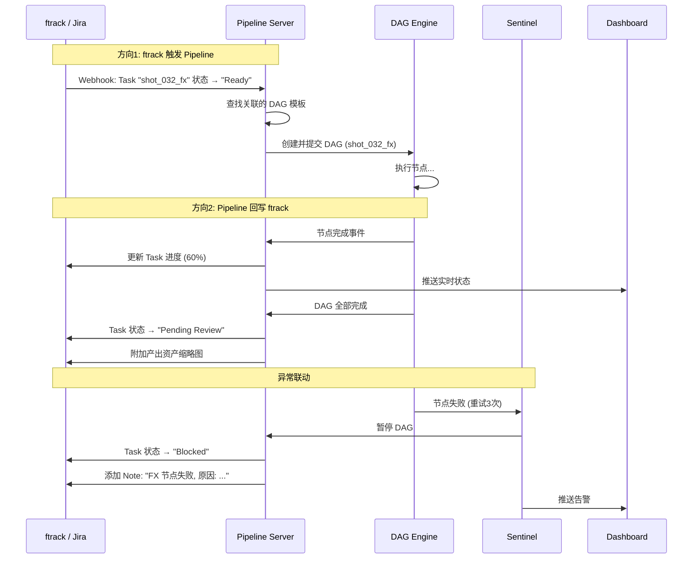
```mermaid
sequenceDiagram
  participant F as ftrack / Jira
  participant P as Pipeline Server
  participant D as DAG Engine
  participant S as Sentinel
  participant Dash as Dashboard

  Note over F,P: 方向1: ftrack 触发 Pipeline
  F->>P: Webhook: Task "shot_032_fx" 状态 → "Ready"
  P->>P: 查找关联的 DAG 模板
  P->>D: 创建并提交 DAG (shot_032_fx)
  D->>D: 执行节点...

  Note over D,F: 方向2: Pipeline 回写 ftrack
  D->>P: 节点完成事件
  P->>F: 更新 Task 进度 (60%)
  P->>Dash: 推送实时状态

  D->>P: DAG 全部完成
  P->>F: Task 状态 → "Pending Review"
  P->>F: 附加产出资产缩略图

  Note over S,F: 异常联动
  D->>S: 节点失败 (重试3次)
  S->>P: 暂停 DAG
  P->>F: Task 状态 → "Blocked"
  P->>F: 添加 Note: "FX 节点失败, 原因: ..."
  S->>Dash: 推送告警
```
